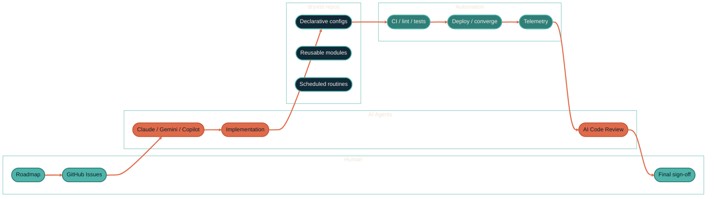

# dryvist

  

  <em>The implementation layer for a fully automated, AI-assisted infrastructure portfolio.</em>

  
  
  
  

---

## What this org is

`dryvist` is where the **infrastructure** lives. Humans set direction, AI
agents implement, automation runs the boring parts, and a human gives the
final sign-off. Every repo here is a piece of that pipeline — declared once,
reproduced everywhere, observable end-to-end.

The org is the implementation. The **map for all of it** lives at
**[docs.jacobpevans.com](https://docs.jacobpevans.com)** — that's where the
architecture, data flows, design decisions, and "how the pieces fit"
explanations live. The repos here ship the moving parts; the docs site tells
you what each part is for.

Everything intended for the public is here. A small set of homelab-private
repos (IP inventories, encrypted secrets, internal schemas) lives in the org
too but is not visible to anyone outside — and won't appear in the categories
below. The public surface is what you see at
[github.com/orgs/dryvist/repositories](https://github.com/orgs/dryvist/repositories).

---

## The flow

The shape of work here: a human files an Issue, AI agents draft the
implementation against `dryvist` repos, CI lints and tests, the deploy
machinery converges the target system, telemetry flows back, AI models review
the resulting PR, and a human gives the final thumbs-up. The full pipeline
philosophy — including why multiple models, where the loop opens and closes,
and what stays human-only — is documented at
[docs.jacobpevans.com](https://docs.jacobpevans.com).

---

## What lives here

  

  
  
  
  
  
  
  
  

The work splits into six broad categories. Each one links to the section of
the docs site that explains how it fits together, why it's structured the
way it is, and how to actually use it.

### [Nix ecosystem](https://docs.jacobpevans.com/nix/overview)

Reproducible everything, from a developer's laptop up to bare-metal servers.
The bet: if your dev shell, your editor config, your AI tooling, and your
production hosts are all declared in Nix, `nix build` becomes the universal
"set up the world" button. Repos in this category cover:

- Declarative dev shells per language and per workload — `nix develop` and
  walk into a fully configured workspace.
- Cross-platform home-manager configs that keep dotfiles, shells, and CLIs
  identical on macOS and Linux.
- AI coding tooling (Claude Code, Gemini, Copilot, local MLX, MCP servers)
  as composable home-manager modules — install your assistants the same
  way you install neovim.
- Full system configs for macOS (`nix-darwin`) and NixOS, including
  AI-workload server profiles with ROCm/CUDA.
- Netboot-based bare-metal bootstrap so a fresh machine joins the fleet
  unattended.

### [Infrastructure as code](https://docs.jacobpevans.com/infrastructure/overview)

OpenTofu for everything provisionable — virtual machines, networks, cloud
accounts, even GitHub itself. Terrakube runs the workspaces inside the homelab,
with short-lived credentials supplied natively by OpenBao. Modules are written
to be reused: golden-image builders and the governance layer that keeps the
whole org consistent.

- Proxmox VMs, LXC containers, networking, firewall rules — declarative,
  with safe concurrent state.
- Terrakube workspace definitions with native remote state and state locking.
- Self-hosted GitHub Actions runners on spot capacity for fast, cheap CI.
- Org-wide GitHub configuration (rulesets, required workflows, repo
  settings) managed in code, not in the UI.

### [Configuration management](https://docs.jacobpevans.com/infrastructure/overview)

Ansible roles that take a provisioned host and turn it into a running
service. Pairs directly with the IaC layer above: Terraform delivers the
box, Ansible delivers the workload.

- Proxmox host hardening, performance tuning, ZFS / swap, monitoring
  baselines.
- Application roles for observability platforms, syslog load balancers,
  and other long-running services.
- Secrets injection via Doppler so playbooks stay declarative and the
  sensitive bits never land on disk.

### [AI development tooling](https://docs.jacobpevans.com/ai-development/overview)

The control plane that ties the rest of the portfolio together. Vendor-
agnostic instructions, reusable workflows, plugins, and scheduled routines
that turn AI assistants into reliable collaborators across every repo.

- A vendor-agnostic AI assistant instruction framework that works the same
  across Claude, Gemini, Copilot, and local models — write the rule once,
  every tool obeys.
- Reusable AI agent workflows for 24/7 portfolio maintenance: issue triage,
  cleanup sweeps, multi-repo orchestration.
- A growing set of Claude Code plugins, agents, skills, hooks, and slash
  commands for the day-to-day developer workflow.
- Scheduled routines that run on a cron — daily portfolio briefings, PR
  triage, repo health scoring, automated polish.

### [Observability](https://docs.jacobpevans.com/observability/overview)

The telemetry fabric under the rest of the portfolio. If something runs,
something is watching it; if an AI touched code, there's a trace.

- Cribl Edge collectors deployed at sources (laptops, Kubernetes nodes,
  homelab hosts) for in-stream shaping before egress.
- Cribl Stream workers that fan out to backends and cut ingest volume
  before it costs you anything.
- OpenTelemetry pipelines for application traces, metrics, and logs.
- Splunk-side configuration for indexes, HEC inputs, apps, and dashboards.
- Benchmark harnesses for local LLM inference on Apple Silicon.

### [Templates &amp; dev tooling](https://docs.jacobpevans.com/ai-development/overview)

The starter scaffolds and small utilities that make spinning up the next
thing fast — so the categories above can grow without rewriting boilerplate.

- Project templates with linting, formatting, type-checking, pre-commit
  hooks, and 100% coverage gates wired up from minute zero.
- Per-project starters for Terrakube-managed OpenTofu workspaces.
- Cribl pack scaffolding for new edge / stream pack repos.
- Small workflow utilities — local-AI-powered issue drafting, scheduled
  maintenance helpers — that smooth the rough edges between humans, AI
  agents, and GitHub itself.

---

## How it fits together

The portfolio is layered. Each layer assumes the one below it is already in
place; each layer is observable to the one above it.

1. **Reproducibility layer (Nix).** Every machine — laptop, dev VM, server —
   starts from a Nix flake. `nix build` is the only way in.
2. **Provisioning layer (Terrakube / OpenTofu).** Once a Nix-built host
   exists, Terrakube workspaces carve up cloud and homelab capacity around it:
   VMs, LXC containers, cloud resources, and GitHub org governance. OpenBao
   supplies short-lived workspace credentials without storing them in code.
3. **Configuration layer (Ansible).** Provisioned hosts get turned into
   services by idempotent roles that pull secrets at runtime and converge
   on a declared state.
4. **Observability fabric (Cribl + OpenTelemetry + Splunk).** Every layer
   above emits telemetry into a shared pipeline that shapes, indexes, and
   alerts. Includes traces from the AI tools themselves.
5. **AI control plane.** Multi-model assistants, reusable workflows, and
   scheduled routines operate across every layer above — drafting changes,
   reviewing PRs, triaging issues, running maintenance — and report back
   through the same observability fabric.

The narrative version of all of this, with diagrams and decision rationale,
is at
[docs.jacobpevans.com/architecture/how-it-fits-together](https://docs.jacobpevans.com).

---

## AI-native by default

Every repo in this org is built with the assumption that AI agents will be
reading, editing, and reviewing the code alongside humans. That means:

- **A canonical instruction layer** — every repo carries (or inherits) an
  `AGENTS.md` so any assistant — Claude, Gemini, Copilot, a local model — gets
  the same context, same rules, same conventions. No "tribal knowledge"
  lives only in the human's head.
- **Multi-model PR review** — every change is reviewed by more than one AI
  model before a human approves. Different models catch different classes of
  bug.
- **Scheduled routines** — long-running maintenance, triage, and health
  checks run on cron without needing a human to start them.
- **Telemetry on the AI itself** — when an assistant touches code, OTEL
  traces and session logs flow into the same observability pipeline as
  everything else.

Why it matters and how to opt into the same pattern in your own repos:
[docs.jacobpevans.com/ai-development/overview](https://docs.jacobpevans.com).

---

## Read the docs first

  

The repos here are the moving parts. **[docs.jacobpevans.com](https://docs.jacobpevans.com)**
is the assembly diagram — architecture, data flows, decisions, and how every
piece connects. If you're trying to understand *why* a repo exists, *how* it
talks to the others, or *where to start* on a particular problem, the answer
is on the docs site first; the code is downstream from that.

The site is organized by capability, not by repo. Reading "Infrastructure" or
"AI Development" or "Observability" there will surface a coherent story
across half a dozen repos at once — which is much faster than crawling
GitHub.

---

## Org-wide standards

Canonical configs and inheritance hub:
[`dryvist/.github`](https://github.com/dryvist/.github). Everything below
is enforced uniformly across every repo in the org.

| Concern | Standard |
| --- | --- |
| License | [Apache-2.0](https://www.apache.org/licenses/LICENSE-2.0) unless a repo states otherwise |
| Commits | [Conventional Commits](https://www.conventionalcommits.org) (`feat:` / `fix:` / `chore:` / …) — drives automated releases |
| Releases | Automated via [release-please](https://github.com/googleapis/release-please) — patch on `fix:`, minor on `feat:`, majors are human-initiated |
| Code review | Every PR reviewed by multiple AI models before a human signs off |
| Code lint / format | [Biome](https://biomejs.dev) for JS/TS/JSON/CSS; canonical config in [`dryvist/.github`](https://github.com/dryvist/.github) |
| Markdown lint | [markdownlint-cli2](https://github.com/DavidAnson/markdownlint-cli2) with org-wide rules |
| Workflow security | [zizmor](https://github.com/woodruffw/zizmor) — org-wide policy at [`dryvist/.github`](https://github.com/dryvist/.github) |
| Dependency updates | [Renovate](https://docs.renovatebot.com) — extends shared presets |
| AI assistant policy | Versioned `AGENTS.md` in every repo; org policy at [`dryvist/.github`](https://github.com/dryvist/.github) |
| CI runners | Self-hosted on AWS spot capacity (fast, cheap), with GitHub-hosted fallback for short macOS jobs |
| Security reporting | [`SECURITY.md`](https://github.com/dryvist/.github/blob/main/SECURITY.md) — auto-applied to every repo's Security tab |

---

## Where this fits in a larger picture

`dryvist` is the **org-wide** layer. A small adjacent set of repos —
GitHub profile assets, deeply personal one-offs — lives on
[`JacobPEvans-personal`](https://github.com/JacobPEvans-personal). Together
the two accounts host the public footprint of one human's automation
practice; the docs site at
[docs.jacobpevans.com](https://docs.jacobpevans.com) is the single front
door to both.

If you're not sure which account owns a given repo, both
[`JacobPEvans/<repo>`](https://github.com/JacobPEvans) and the original URL
in any older link will redirect to the current owner.

---

  

<em>One front door. Read the docs first.</em>

